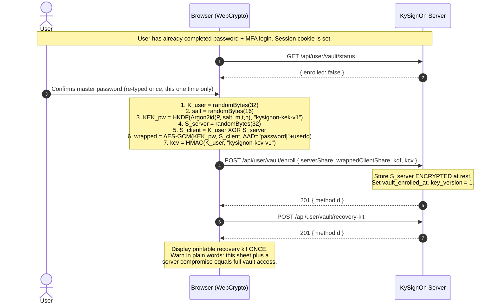
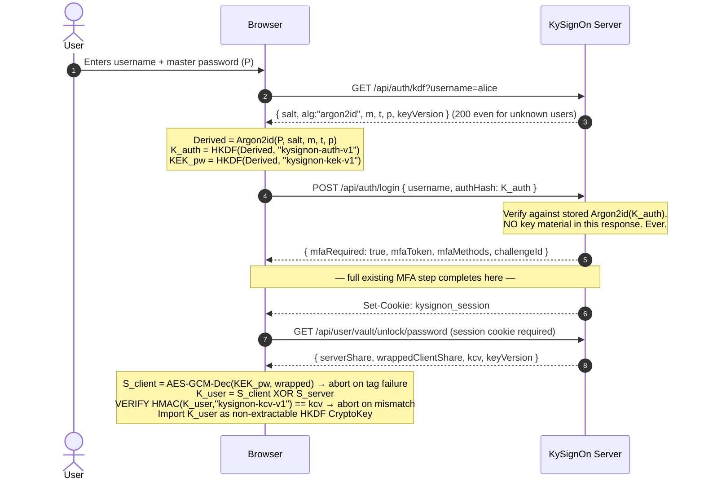
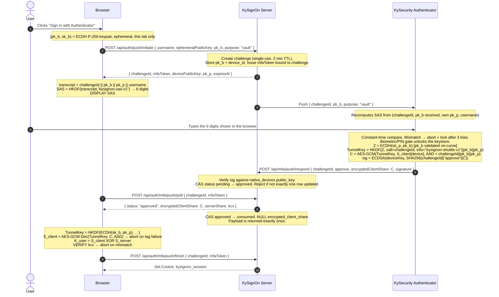
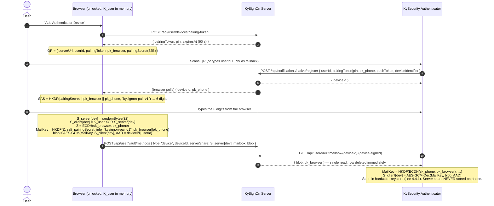

# KySignOn: Split-Key Vault Unlock — Implementation Plan (v2)

**Status:** Draft for review. Supersedes `e2ee_split_key_sso_plan.md` (v1), which is withdrawn.
**Goal:** Remove the second key-entry step across the KySecurity suite without weakening the
end-to-end encryption that step currently protects.

---

## 0. What Changes For The User

Today: sign in to KySignOn → land in KyNotes → **type a second vault password**.

After this work:

| Path | User action | Result |
|------|-------------|--------|
| Password unlock (1+D) | Types master password **once**, at the KySignOn login screen | Every suite vault opens |
| Phone unlock (3+D) | Taps "Sign in with Authenticator", types 6 digits into the phone | Every suite vault opens, no password typed |
| Recovery | Enters printed recovery code | Vault opens, prompted to re-enrol |

The second password box disappears. The cryptography that made it necessary does not.

---

## 1. Threat Model

Written first, because v1 made four "Trust-No-One" claims with no stated adversary.

### 1.1 Defended

| Adversary | Outcome |
|-----------|---------|
| Attacker with a stolen SQLite file or backup | No vault access. Needs the master password (Argon2id-hard) or a paired phone. |
| Attacker with the master password only | No vault access without also passing MFA — the server refuses to release its share pre-MFA. |
| Attacker with a stolen/unpaired phone | Nothing. The phone holds one 32-byte share of a 2-of-2 split; the other half is server-held and released only to an authenticated session. Revoking the device deletes the server half permanently. |
| Attacker who is passively MITM on the push channel | Nothing. The shuttle is ECDH-encrypted end to end and integrity-bound to the challenge. |
| **KySignOn server actively substituting keys** in the push shuttle | **Detected.** The 6-digit code the user types is derived from the ECDH transcript; a substituted browser key produces a code the phone rejects. |
| Malicious downstream app requesting another app's key | Rejected. Per-app keys are derived with the OAuth `client_id` in the HKDF info string and delivered only to the registered redirect origin. |
| Push-fatigue / blind approval | Cannot leak key material. Key release requires the user to **type** a code they can only read from the real browser. Tap-to-approve grants a session only, never key material. |

### 1.2 NOT Defended — stated plainly, per project policy

1. **A compromised KySignOn origin serving malicious JavaScript.** In Web Mode the server delivers
   the code that reconstructs the key. A malicious or supply-chained server can exfiltrate
   everything. This is inherent to browser-delivered E2EE and cannot be engineered away here.
   Mitigations that reduce (not eliminate) it: strict CSP with no `unsafe-inline`, subresource
   integrity on all bundles, reproducible builds with published hashes, and a native/extension
   Companion Mode for users who need a trust anchor outside the server.
   → **This must appear in `SECURITY.md` and in the product UI. We do not market TNO we cannot hold.**
2. **A compromised endpoint (keylogger, malicious extension, root).** Out of scope.
3. **Data already decrypted and cached by a downstream app** on a device that is later stolen.
   Revoking an unlock method stops *future* unlocks; it does not reach into a device's local cache.
4. **Offline brute force of a weak master password** against a stolen database. Argon2id raises the
   cost; it does not remove it. Password strength meter and a 12-character minimum stay.

---

## 2. Key Hierarchy

v1 derived the master key from the password. That made every password change a silent
data-destruction event. v2 generates the master key once and wraps it.

```
                          Vault data (KyNotes note, KyPost message body, …)
                                            ▲
                                   AES-256-GCM
                                            │
                                        DEK_app          random per app, per user
                                            ▲             re-wrapped on rotation,
                                   AES-256-GCM            never re-encrypts bulk data
                                            │
                                        K_app  =  HKDF(K_user, info = "kysignon-app-v1|" || client_id)
                                            ▲
                                            │
                                        K_user           random 32 bytes, generated ONCE at
                                            ▲             enrolment, never derived from anything,
                                            │             never leaves client RAM
                    ┌───────────────────────┴───────────────────────┐
                    │        K_user = S_client[m] ⊕ S_server[m]     │
                    │        one INDEPENDENT share pair per          │
                    │        unlock method m                         │
                    └───────────────────────┬───────────────────────┘
        ┌───────────────────────┬───────────┴───────────┬───────────────────────┐
        ▼                       ▼                       ▼                       ▼
  m = password            m = device:phone-1      m = device:phone-2       m = recovery
  S_client wrapped by     S_client in phone       S_client in phone        S_client wrapped by
  KEK_pw (Argon2id)       hardware keystore       hardware keystore        KEK_r (printed code)
  S_server in DB          S_server in DB          S_server in DB           S_server in DB
```

### 2.1 Invariants (each one testable — see §9)

1. `K_user` is generated by `crypto.getRandomValues` on the client at enrolment and is never a
   function of the password. **Consequence: password change is a re-wrap, not a re-key.**
2. Each unlock method holds an **independent** share pair. Compromising or revoking one method
   tells you nothing about any other. **Consequence: unpairing a phone is instant and permanent —
   delete `S_server[device]` and the phone's share is 32 bytes of noise forever. No bulk
   re-encryption required.**
3. The server never holds both halves of any pair for the password or recovery methods without
   also needing a secret it does not have (the password / the printed code). For device methods it
   holds only `S_server[device]`; `S_client[device]` exists nowhere but the phone's keystore.
4. `S_server[m]` is **encrypted at rest** under the server's configured encryption key, and is
   released only over an authenticated, MFA-completed session.
5. Both unlock paths terminate in the same client-side operation: `K_user = S_client ⊕ S_server`,
   followed by a mandatory key-check (§4.6) before any write.

### 2.2 Honest note on what the split buys

For the **device** path the split is cryptographically load-bearing: the two halves live on two
different machines and neither alone is anything.

For the **password** and **recovery** paths the server holds both `S_server[m]` and the wrapped
`S_client[m]`, so the split is *not* cryptographically additive over plain envelope encryption —
security there rests entirely on Argon2id and the printed code. What the split *does* buy on those
paths is operational: a single uniform release gate, a single uniform revocation primitive, and one
client-side combine routine instead of three. We keep it for that reason and we do not claim more.

---

## 3. Cryptographic Primitives — fully specified

| Purpose | Algorithm | Notes |
|---------|-----------|-------|
| Password KDF | Argon2id, **m = 65536 KiB, t = 4, p = 1** | `p=1` because WASM threading needs COOP/COEP headers we do not want to require. Parameters are **stored per user** and returned by the KDF endpoint so they can be raised later. Tuning target: 0.5–1.0 s on a low-end laptop; re-benchmark before launch. |
| Key separation | HKDF-SHA256 | Every `info` string carries an explicit version: `"kysignon-<purpose>-v1"`. |
| Symmetric AEAD | AES-256-GCM, 96-bit random nonce | Nonce prepended, matching existing `crypto.EncryptAESGCM`. |
| Key agreement | ECDH **P-256** via Go `crypto/ecdh` and WebCrypto | `crypto/ecdh`, **not** `crypto/elliptic` scalar mult — `ecdh.P256().NewPublicKey()` validates the point is on-curve and non-identity. Invalid input is a hard error, never a fallback. |
| Device signatures | ECDSA P-256 over SHA-256 | Verified against `native_devices.public_key`, a column that exists today and has never once been used. |
| Key check value | HMAC-SHA256 | `kcv = HMAC(K_user, "kysignon-kcv-v1")` |
| Recovery code | 32 random bytes, Crockford base32, 13 groups of 4 | KEK derived with HKDF (no Argon2 needed — the input is already 256 bits). |

**Never** use a raw ECDH output as a key. v1 wrote `TunnelKey = ECDH(...)`. The rule is:

```
Z         = ECDH(sk, pk)                       // pk validated on import; abort on error
TunnelKey = HKDF-SHA256(ikm = Z,
                        salt = challengeId,
                        info = "kysignon-shuttle-v1" || pk_browser || pk_phone)
```

**Every** AES-GCM operation that crosses a trust boundary carries AAD binding it to its context.
An unbound ciphertext is a replayable ciphertext.

---

## 4. Protocols

### 4.1 Enrolment (first vault unlock after this ships)

There is no `/api/auth/register` in this product and there never was — accounts are admin-provisioned
(`internal/api/admin_handlers.go:60`). Enrolment is therefore a **session-authenticated ceremony**,
not part of registration.



The re-typed password at step "User confirms" is the **last** time the user ever types a second key.

### 4.2 Password Unlock (1 + D)



**The change that matters:** `serverShare` moved out of the login response and behind a
session-authenticated endpoint that only exists after MFA has completed. In v1, a stolen password
alone yielded every vault and MFA was decorative.

### 4.3 Phone Unlock — Key Shuttle (3 + D)



**Why the typed code, not tap-to-match.** Tap-to-match asks the user to pick one of four numbers.
A blind push-fatigue attacker wins 1 time in 4; a real-time phishing page wins every time, because
it simply shows the victim the correct number — which v1 helpfully returned to the initiator in the
API response. Typing a code inverts this: the attacker would have to make the *phone* accept a code
derived from a transcript containing the attacker's key, and the phone computes that transcript
itself. It cannot be faked by anyone in the middle, including the server.

**Rule:** `purpose: "session"` challenges may use tap-to-match (4-way, unchanged UX for ordinary
MFA). `purpose: "vault"` challenges **must** use typed SAS. The server enforces this by refusing to
attach `encrypted_client_share` to a `session` challenge, and refusing to release shares from one.

### 4.4 Device Pairing



v1 specified this step as "Direct WebRTC / Local Relay or KySignOn Blind Mailbox" — three transports,
no choice, no protocol. **Decision: Blind Mailbox only.** WebRTC in a homelab behind NAT is a support
burden with no security gain, and the mailbox row is single-read and TTL-bounded.

**4.4.1 Phone-side storage.** `S_client[device]` is never written to disk in the clear.
- **Android:** encrypted with an AES-256 key in the Android Keystore created with
  `setUserAuthenticationRequired(true)`, StrongBox when available.
- **iOS:** Keychain item, `kSecAttrAccessibleWhenUnlockedThisDeviceOnly`, `SecAccessControl` with
  `.biometryCurrentSet` (so adding a fingerprint invalidates it).

### 4.5 Cross-Origin Key Handoff — no iframe

v1 specified `BroadcastChannel`, which is same-origin only. The suite apps live on separate
subdomains (`notes.`, `passwords.`, `mail.`), so it cannot work — not "needs tuning", cannot work.

**You asked whether there is a way without an iframe. Yes, and it is the better option anyway:**
an iframe on the app's origin is a third-party context, so under storage partitioning and
third-party-cookie blocking (Safari today, Chrome increasingly) the KySignOn iframe may not get its
own session cookie and the handoff breaks silently for a subset of users. The redirect + URL
fragment pattern has none of that, because everything happens in a first-party top-level context.

It folds into the OIDC flow you already have, adding **zero** extra round trips:

```
1.  KyNotes generates an ephemeral P-256 keypair (pk_app, sk_app), sk_app in page memory only.

2.  KyNotes redirects to:
    /oauth/authorize?...&key_handoff=1&handoff_pk=<pk_app>

3.  The KySignOn authorize page (which holds K_user as a non-extractable CryptoKey) does,
    in the browser, after the user approves:
        K_app     = HKDF(K_user, info = "kysignon-app-v1|" || client_id)
        Z         = ECDH(sk_ephemeral_kysignon, pk_app)
        WrapKey   = HKDF(Z, salt = code, info = "kysignon-handoff-v1" || client_id)
        payload   = AES-GCM(WrapKey, K_app, AAD = client_id || code || redirect_uri)

4.  Navigate to:
    <redirect_uri>?code=<code>#kh=<payload>&kh_pk=<pk_kysignon>

5.  KyNotes reads location.hash, immediately history.replaceState() to strip it,
    decrypts K_app, then exchanges `code` for tokens over the normal back channel.
```

Properties:
- **The fragment is never transmitted to any server.** Browsers do not send it in the request line
  or in `Referer`. The server issues the `code`; it never sees `K_app`.
- `handoff_pk` and `redirect_uri` are both validated against the registered OAuth client using the
  existing `ValidateRedirectURI` (commit `2c0d55d`). AAD binds the payload to `client_id`, `code`,
  and `redirect_uri`, so a payload minted for KyNotes is useless to KyBookmarks.
- Works with third-party cookies fully blocked, in every browser, with no `postMessage` origin
  allowlist to get wrong.
- One-shot: the `code` is single-use already, and the AAD binds to it.

**Storage of `K_user` on the KySignOn origin between navigations:** imported via
`crypto.subtle.importKey(..., extractable: false, ['deriveKey','deriveBits'])` and held in
IndexedDB as a non-extractable `CryptoKey`. Script — including injected script — can *use* it to
derive per-app keys but cannot read the bytes out. Cleared on logout and on tab close where the
platform allows. This is what "encrypted at rest" means in a browser; `sessionStorage`, which v1
proposed one page after asserting "No Key at Rest", stores plaintext readable by any script on the
origin and is banned.

### 4.6 Key check before any write — non-negotiable

Nothing in v1 let the client tell a correct `K_user` from 32 plausible garbage bytes. A stale
`S_server`, a restored backup, or an injected `encryptedClientShare` all reconstruct *something*,
and the client then happily encrypts new data under a key that cannot decrypt the old.

```
reconstructed = S_client XOR S_server
if !constantTimeEqual(HMAC(reconstructed, "kysignon-kcv-v1"), kcv) {
    abort; surface "vault key mismatch — do not proceed"; audit event; DO NOT WRITE
}
```

The client must refuse to encrypt anything until this passes. This is ten lines and it is the
difference between an error message and an unrecoverable vault.

### 4.7 Password change

```
1. Client unlocks normally → holds K_user and S_client[password].
2. Client derives KEK_pw' from the new password + a NEW salt.
3. wrapped' = AES-GCM(KEK_pw', S_client[password], AAD = "password|" + userId)
4. K_auth'  = HKDF(Derived', "kysignon-auth-v1")
5. POST /api/user/vault/password/rewrap { authHash: K_auth', wrappedClientShare: wrapped', kdf' }
   — server updates password_hash and the method row in ONE transaction.
6. K_user unchanged. Device methods and the recovery method are untouched. Zero data re-encrypted.
```

### 4.8 Admin password reset — explicit, not silent

An admin cannot re-wrap `S_client[password]`; they do not have it. So the reset **must not pretend
to succeed**:

```
1. Admin resets password.
2. Server sets vault_unlock_methods[password].status = 'needs_reenroll' in the same transaction.
3. All sessions revoked (already happens: admin_handlers.go:179).
4. Admin UI shows, before confirming:
   "This resets sign-in only. <user> must unlock with their phone or recovery kit
    and set a new vault password. Their data is not lost and you cannot recover it for them."
5. On next login the user unlocks via phone or recovery kit, then re-enrols the password method
   (§4.1 steps 2–7, reusing the existing K_user).
```

v1 shipped this path as silent, total, unrecoverable data loss with a `200 OK`.

### 4.9 Revocation

Because each method has its own share pair (§2.1 invariant 2), revoking is one row:

```sql
UPDATE vault_unlock_methods SET status='revoked', server_share_enc='', revoked_at=?
WHERE id=? AND user_id=?;
```

The phone keeps `S_client[device]` and it is now permanently worthless — the counterpart share is
gone and cannot be reconstructed. No bulk re-encryption. No key rotation. Instant and cryptographic.

The UI may say "this device can no longer unlock your vault" and be telling the truth. It must
*also* say that data the app already downloaded to that device remains in that device's local cache
(§1.2 item 3).

Optional `K_user` rotation (for a user who wants belt and braces after a theft) is cheap because of
the DEK layer: re-wrap N per-app DEKs, re-split for each remaining method. Bulk data is never
touched. Ship it in M6, not before.

---

## 5. Database Schema

### 5.1 Migration framework — first, before any key column exists

The current pattern is `_, _ = s.db.Exec("ALTER TABLE …")` with the error discarded
(`internal/store/store.go:213`). That is survivable for a nullable `launch_url`. It is not
survivable for key material: a genuine failure produces a server that starts cleanly and then fails
every vault query at runtime with no startup diagnostic.

```go
// internal/store/migrate.go
type migration struct {
    version int
    stmts   []string
}

var migrations = []migration{
    {1, []string{ /* existing CREATE TABLE IF NOT EXISTS block, verbatim */ }},
    {2, []string{`ALTER TABLE oauth_clients ADD COLUMN launch_url TEXT`}},
    {3, []string{ /* §5.2 vault tables */ }},
    {4, []string{ /* §5.3 challenge + mfa token changes */ }},
}

func (s *Store) migrate() error {
    var current int
    if err := s.db.QueryRow(`PRAGMA user_version`).Scan(&current); err != nil {
        return fmt.Errorf("read schema version: %w", err)
    }
    for _, m := range migrations {
        if m.version <= current {
            continue
        }
        tx, err := s.db.Begin()
        if err != nil {
            return err
        }
        for _, stmt := range m.stmts {
            if _, err := tx.Exec(stmt); err != nil {
                _ = tx.Rollback()
                return fmt.Errorf("migration %d failed: %w", m.version, err)
            }
        }
        if _, err := tx.Exec(fmt.Sprintf(`PRAGMA user_version = %d`, m.version)); err != nil {
            _ = tx.Rollback()
            return err
        }
        if err := tx.Commit(); err != nil {
            return err
        }
    }
    return nil
}
```

Migration 1 sets `user_version = 1` on databases that already have the tables (the
`IF NOT EXISTS` statements are no-ops there). Errors propagate; `New()` already returns them
(`store.go:27`) and the process fails to start. That is the correct behaviour.

### 5.2 Vault tables

No `NOT NULL DEFAULT ''`. v1's default would have given every existing user an empty salt and an
empty share, and the client would have had to distinguish "not enrolled" from "enrolled with an
empty string". Enrolment state is a column, not a sentinel.

```sql
CREATE TABLE IF NOT EXISTS user_vaults (
    user_id      TEXT PRIMARY KEY REFERENCES users(id) ON DELETE CASCADE,
    key_version  INTEGER  NOT NULL DEFAULT 1,
    kcv          TEXT     NOT NULL,              -- hex HMAC-SHA256(K_user,"kysignon-kcv-v1")
    enrolled_at  DATETIME NOT NULL,
    updated_at   DATETIME NOT NULL
);

CREATE TABLE IF NOT EXISTS vault_unlock_methods (
    id                   TEXT PRIMARY KEY,
    user_id              TEXT     NOT NULL REFERENCES users(id) ON DELETE CASCADE,
    method_type          TEXT     NOT NULL,      -- 'password' | 'device' | 'recovery'
    device_id            TEXT     REFERENCES native_devices(id) ON DELETE CASCADE,
    server_share_enc     TEXT     NOT NULL,      -- AES-GCM(server key, S_server[m]) — NEVER plaintext
    wrapped_client_share TEXT,                   -- AES-GCM(KEK, S_client[m]); NULL for method_type='device'
    kdf_json             TEXT,                   -- {"alg":"argon2id","m":65536,"t":4,"p":1,"salt":"<b64>"}
    key_version          INTEGER  NOT NULL DEFAULT 1,
    status               TEXT     NOT NULL DEFAULT 'active',  -- 'active' | 'revoked' | 'needs_reenroll'
    created_at           DATETIME NOT NULL,
    last_used_at         DATETIME,
    revoked_at           DATETIME
);

CREATE UNIQUE INDEX IF NOT EXISTS idx_vault_singleton
    ON vault_unlock_methods(user_id, method_type)
    WHERE method_type IN ('password','recovery') AND status = 'active';

CREATE UNIQUE INDEX IF NOT EXISTS idx_vault_device
    ON vault_unlock_methods(user_id, device_id)
    WHERE method_type = 'device' AND status = 'active';

CREATE TABLE IF NOT EXISTS vault_pairing_mailbox (
    device_id   TEXT PRIMARY KEY REFERENCES native_devices(id) ON DELETE CASCADE,
    blob        TEXT     NOT NULL,               -- AES-GCM to the phone; server cannot read it
    browser_pk  TEXT     NOT NULL,
    expires_at  DATETIME NOT NULL,
    created_at  DATETIME NOT NULL
);
```

`server_share_enc` uses the same `crypto.EncryptAESGCM(e.encryptionKey, …)` that already protects
TOTP secrets (`mfa.go:93`). v1 stored the single most sensitive column in the product as plaintext
`TEXT` while encrypting TOTP seeds.

### 5.3 Challenge and MFA-token changes

```sql
ALTER TABLE mfa_challenges ADD COLUMN purpose                TEXT NOT NULL DEFAULT 'session';
ALTER TABLE mfa_challenges ADD COLUMN device_id              TEXT;
ALTER TABLE mfa_challenges ADD COLUMN ephemeral_public_key   TEXT;
ALTER TABLE mfa_challenges ADD COLUMN encrypted_client_share TEXT;
ALTER TABLE mfa_challenges ADD COLUMN consumed_at            DATETIME;

CREATE TABLE IF NOT EXISTS mfa_tokens (
    id           TEXT PRIMARY KEY,
    user_id      TEXT     NOT NULL REFERENCES users(id) ON DELETE CASCADE,
    token_hash   TEXT     NOT NULL UNIQUE,       -- SHA-256 of the raw token
    challenge_id TEXT     REFERENCES mfa_challenges(id) ON DELETE CASCADE,
    expires_at   DATETIME NOT NULL,
    used_at      DATETIME,
    created_at   DATETIME NOT NULL
);
CREATE INDEX IF NOT EXISTS idx_mfa_tokens_hash ON mfa_tokens(token_hash);
```

### 5.4 Retention sweep

`encrypted_client_share` is NULLed the instant the poll consumes it, and a sweep runs every 60 s:

```sql
UPDATE mfa_challenges SET encrypted_client_share = NULL, ephemeral_public_key = NULL
    WHERE expires_at < ? AND encrypted_client_share IS NOT NULL;
DELETE FROM mfa_challenges         WHERE expires_at < datetime(?, '-24 hours');
DELETE FROM vault_pairing_mailbox  WHERE expires_at < ?;
DELETE FROM mfa_tokens             WHERE expires_at < ?;
```

Nothing carrying key material outlives its window. v1 would have accumulated a permanent archive of
vault-key ciphertexts in `mfa_challenges`.

---

## 6. API Contracts

### 6.1 Universal validation rules

Applied by a shared decoder helper before any handler logic. v1 specified no validation anywhere.

| Rule | Value |
|------|-------|
| Max request body | 16 KiB on all `/api/auth/*` and `/api/user/vault/*` |
| `serverShare`, `clientShare`, `kcv` | base64, decodes to **exactly 32 bytes**, else 400 |
| `ephemeralPublicKey`, `devicePublicKey` | base64, decodes to a valid uncompressed P-256 point via `ecdh.P256().NewPublicKey()`, else 400 |
| `wrappedClientShare`, `encryptedClientShare`, `mailbox` | base64, 12 ≤ len ≤ 256 bytes |
| `signature` | base64 ASN.1 ECDSA, ≤ 128 bytes |
| `username` | ≤ 64 chars |
| `challengeId`, `deviceId`, `methodId` | parses as a UUID |
| `kdf_json` | `alg == "argon2id"`, `m ∈ [19456, 1048576]`, `t ∈ [2, 16]`, `p ∈ [1, 4]`, salt exactly 16 bytes |
| Every field | rejected on excess length **before** any DB or crypto work |

Rate limits use the existing `middleware.RateLimit`:
`kdf` 20/0.5 · `vault_unlock` 10/0.2 · `push_initiate` 10/0.2 · `push_poll` 60/2.0 · `push_respond` 15/0.5 · `pairing` 10/0.2

### 6.2 `GET /api/auth/kdf?username=alice`

Replaces v1's `/api/auth/salt`, which returned only a salt (freezing KDF strength forever) and
leaked account existence.

```json
{ "salt": "…", "alg": "argon2id", "m": 65536, "t": 4, "p": 1, "keyVersion": 1 }
```

**Always 200, always constant time.** For an unknown or unenrolled user, return a deterministic
decoy: `salt = HMAC(server_pepper, lowercase(username))[:16]` with current default params. An
attacker learns nothing; a legitimate client gets a deterministic answer.

### 6.3 `POST /api/auth/login`

```json
{ "username": "alice", "authHash": "<hex K_auth>" }
```

Response is **exactly what it is today** — MFA branch preserved, `mfaToken` now backed by a
persisted `mfa_tokens` row. **No key material in this response under any circumstances.**

```json
{ "success": false, "mfaRequired": true, "mfaToken": "…", "mfaMethods": ["push","totp"], "challengeId": "…" }
```

`matchDigits` and `decoyDigits` are returned only for `purpose:"session"`, where the browser must
display the number for the user to tap on the phone. They are **never** returned for
`purpose:"vault"`, where the browser derives the SAS from the ECDH transcript instead. See the
correction note in §7 M1.

### 6.4 `GET /api/user/vault/unlock/password` — session + MFA required

```json
{ "serverShare": "…", "wrappedClientShare": "…", "kdf": { … }, "kcv": "…", "keyVersion": 1 }
```

Behind `authM`. Audited on every call. Returns 409 `needs_reenroll` if the method status says so.

### 6.5 `POST /api/auth/push/initiate`

```json
{ "username": "alice", "ephemeralPublicKey": "…", "purpose": "vault" }
```
```json
{ "challengeId": "…", "mfaToken": "…", "devicePublicKey": "…", "expiresAt": "…" }
```

The **SAS is not in the response**. The browser computes it locally from the transcript; that is the
entire point. A server that could dictate the SAS could substitute keys undetected.

### 6.6 `POST /api/mfa/push/respond` — device-signed, no session

```json
{
  "challengeId": "…",
  "approve": true,
  "encryptedClientShare": "…",
  "signature": "<base64 ECDSA-P256-SHA256>"
}
```

**Signature specification** — v1 wrote `"signature": "..."`, three dots standing between an attacker
and every user's vault. The shipped M1 format is:

```
message = "kysignon-push-v1" || "|" || challengeId || "|" || ("approve"|"deny") || "|" || selectedDigits
sig     = ECDSA-P256-SHA256(device_private_key, message)          // ASN.1 DER, base64
```

M4 introduces `kysignon-push-v2`, appending `encryptedClientShare` and `purpose`. The version
prefix domain-separates the two, so a v1 signature can never be replayed as a v2 approval that
releases key material. See `mfa.PushResponseMessage`.

Server: verify against the `public_key` of the challenge owner's enrolled approver devices, reject
on failure with an audit event. An unsigned or wrongly-signed response is never processed.

`selectedDigits` carries the tapped number for `purpose:"session"` and is covered by the signature,
so it cannot be flipped in transit. For `purpose:"vault"` it is absent — the phone verifies the
typed SAS locally and the server never sees or arbitrates it.

The CSRF exemption for this path (`middleware.go:215`) stays — it is a native client — but the
endpoint is no longer unauthenticated, because the signature *is* the authentication.

### 6.7 `POST /api/auth/mfa/push/poll` — single use, token-bound

```json
{ "challengeId": "…", "mfaToken": "…" }
```

Server: look up `mfa_tokens` by SHA-256 of the raw token, assert it is unused, unexpired, and bound
to this exact `challengeId`. Then compare-and-swap:

```sql
UPDATE mfa_challenges SET status='consumed', consumed_at=?, encrypted_client_share=NULL
WHERE id=? AND status='approved';
```

Only if `RowsAffected == 1` does the payload get returned, and only once. Every subsequent poll for
that challenge gets `{"status":"consumed"}` and nothing else.

### 6.8 `POST /api/auth/mfa/push/finish`

```json
{ "challengeId": "…", "mfaToken": "…" }
```

Server **must** assert, in this order: token hash exists → unused → unexpired →
`token.user_id == challenge.user_id` → challenge belongs to that user → challenge reached approved.
Then mark the token used and issue the session.

The user ID is read from the **persisted token row**, never parsed out of the client-supplied
string. See §7 M1.

### 6.9 `POST /api/notifications/native/register`

Now requires `userId` alongside the PIN. The PIN lookup becomes:

```sql
SELECT … FROM device_pairing_tokens
WHERE user_id = ? AND pin_code = ? AND used_at IS NULL AND expires_at > ? AND attempts < 3
```

with `attempts` incremented on every failure and the token dead at 3. v1 inherited a **globally
scoped** 6-digit PIN lookup (`store.go:497`) — guess any live PIN and you attach your phone, as an
MFA approver, to a stranger's account.

---

## 7. Milestones

**Milestone 1 — Security hotfix. Ships alone, immediately, before any of this plan.**

These are live defects in `master` today, independent of E2EE. The push shuttle would be built
directly on top of them.

1. `mfaToken` is generated at `auth_handlers.go:118-127` and **never stored or validated** — the
   server parses a user ID out of an attacker-supplied string. Persist it (`mfa_tokens`), hash it,
   bind it to the challenge, make it single-use, read the user ID from the row.
2. `FinishPushLogin` (`auth_handlers.go:299-327`) never checks that the challenge belongs to the
   claimed user. Add the check.
3. `/api/mfa/push/respond` is unauthenticated and CSRF-exempt, and `RespondPushChallenge`
   (`mfa.go:297`) verifies no device and no signature. Add ECDSA verification against
   `native_devices.public_key`.
4. `UpdateMFAChallengeStatus` (`mfa.go:320`) is an unconditional UPDATE. Make every transition a
   compare-and-swap with a `RowsAffected` check.
5. `/api/auth/mfa/push/poll` and `/finish` have no rate limit, and `RespondPush` interpolates
   `err.Error()` into a JSON string literal. Fix both.

Combined, 1–3 are an authentication bypass: `POST /api/auth/mfa/push/finish` with
`{"mfaToken":"aaaa:<victim-id>","challengeId":"<any approved challenge>"}` yields a session as the
victim. **Push MFA currently provides zero security.** M1 does not wait for M0.

**Correction to an earlier finding.** The review also called for removing `matchDigits` from the
login response. That was wrong, and implementation showed why: the browser must display the number
for the user to pick it on the phone — that *is* the number-match UX. The defect was never that the
browser learns the digits; it was that an unauthenticated endpoint accepted them from anyone. Once
the responder must present a device signature (item 3), knowing `matchDigits` grants nothing, and a
real-time phishing proxy would learn them from the rendered page regardless. `matchDigits` stays for
`purpose:"session"`. Vault-purpose challenges (M4) still echo nothing, because there the browser
derives the SAS itself from the ECDH transcript.

**Status: M1 is implemented.** Regression tests in `internal/api/push_auth_test.go` and
`internal/mfa/mfa_test.go`. Both critical checks were mutation-tested to confirm the tests fail when
the check is removed.

**Milestone 0 — Hostile protocol harness. Before any product code.**

A standalone Go + headless-browser harness implementing the full protocol against a **deliberately
malicious server** that:

- substitutes `pk_browser` in the push shuttle (must be caught by the SAS)
- substitutes `pk_phone` at pairing (must be caught by the pairing SAS)
- returns a **stale** `S_server` from a prior enrolment (must be caught by the KCV)
- returns an **empty** or all-zero `S_server` (must be rejected, not XORed)
- replays a consumed poll response (must return nothing)
- returns a `serverShare` belonging to a different user (KCV)
- omits the AAD / mutates the `challengeId` (GCM tag failure)
- serves an off-curve or identity `devicePublicKey` (import must error, not fall back)

If the protocol does not survive this harness, it does not get built. Verification is Milestone 0,
not Milestone 5 — v1 scheduled the testing of a cryptographic protocol *after* four milestones of
code had already assumed it was correct, in a repo whose own rules say **do not assert safety
properties, test them first.**

**Milestone 2 — Foundations.** `PRAGMA user_version` migration framework (§5.1); `internal/vault`
package with XOR / HKDF / KCV / ECDH helpers over `crypto/ecdh`; encrypted-at-rest share storage;
shared request-validation helper (§6.1); retention sweep (§5.4). Plus the §10 code fixes.

**Milestone 3 — Password path.** `/api/auth/kdf`, enrolment ceremony, session-gated unlock
endpoint, client Argon2id (WASM) with benchmarked params, re-wrap on password change, admin-reset
`needs_reenroll` handling with the honest admin UI copy.

**Milestone 4 — Phone path.** Typed-SAS shuttle, device-signed respond, single-use poll, pairing
blind mailbox, per-device share pairs, one-row revocation.

**Milestone 5 — Suite integration.** OIDC fragment handoff (§4.5) and the per-app DEK wrapping
contract. Order is chosen by risk, not by product priority:

1. **KyNotes** — zero users, all-data scope. Breaking change: old vault path deleted outright.
   Proves the handoff end to end with nothing to lose.
2. **KyPasswords, KyBookmarks** — zero users. Same breaking change, in parallel once KyNotes is
   proven.
3. **KyPost** — real users, encrypted mail only. Last, behind a per-user flag, with the §8
   verify-before-delete ceremony. Nothing about KyPost ships until the other three have been running
   in production long enough to expose protocol bugs.

**Milestone 6 — Optional `K_user` rotation** after device theft. Cheap because of the DEK layer.
Not before.

---

## 8. Migration From Today's Second-Password Step

**KyNotes, KyPasswords and KyBookmarks have zero users.** They get a breaking change: drop the
existing vault tables, remove the second-password code path entirely, and require v2 enrolment.
No migration ceremony, no dual-wrapping, no feature flag, no compatibility shim. Do not write
migration code for users who do not exist.

The only rule for the greenfield three: **delete the old path in the same commit that adds the new
one.** A second-password fallback left in the codebase "just in case" is a bypass of everything in
§1 and it will still be there in two years.

**KyPost has real users and is the only genuine migration.** Its scope is narrow — encrypted mail
only (§11), not the IMAP mailbox — so the ceremony touches one key, once:

```
1. User signs in via SSO. KyPost detects: KySignOn vault enrolled, encrypted-mail key not migrated.
2. KyPost prompts for the old encrypted-mail password — the LAST time it is ever asked.
3. KyPost unwraps its existing DEK the old way.
4. KyPost obtains K_app via the OIDC fragment handoff (§4.5).
5. KyPost re-wraps the SAME DEK under K_app, stored alongside the old wrapping.
6. Verify: unwrap via K_app, decrypt one known encrypted message, compare plaintext. Only then
   delete the old wrapping.
7. Mark migrated. The second password box never appears again.
```

Stored mail is **never** re-encrypted — only the DEK wrapping changes. That is what the DEK layer in
§2 buys, and it is also why `K_user` rotation in M6 is affordable for every app.

Rollback: while both wrappings coexist (steps 5–6) KyPost can fall back to the old password path.
Do not delete the old wrapping until step 6 verifies. Behind a per-user `vault_v2` flag —
**KyPost only.**

### 8.1 Why the greenfield apps still get the DEK layer

With no data to migrate, the DEK layer is not load-bearing today. Build it anyway: it is one wrapped
32-byte blob per app, and without it any future `K_user` rotation (M6, post-device-theft) means
re-encrypting every note in the vault instead of rewriting one row. Twenty lines now against a
rewrite later.

---

## 9. Test Matrix

v1 proposed testing that a 32-byte value is "statistically indistinguishable from random noise
(H ≈ 256 bits)". Entropy is a property of a distribution, not of a sample; there is no assertion you
can write there that means anything. It also proposed an "E2E test verifying 0 server exposure of
keys" — you cannot test the absence of a behaviour over an unbounded input space.

Here is what is actually testable.

### 9.1 `internal/vault` — unit

| Test | Assertion |
|------|-----------|
| Known-answer XOR/HKDF/KCV | Fixed vectors round-trip; committed as golden files |
| Share length | Any share not exactly 32 bytes is rejected, including empty and all-zero |
| Distinct enrolments | Two enrolments with the **same password** produce different `S_server` and different `K_user` — catches a deterministic master key, the bug that actually matters |
| KCV rejection | A single flipped bit in `S_server` or `S_client` fails the check **before** any encrypt call |
| ECDH import | Off-curve point, identity point, wrong length, and empty input each return an error, never a zero key |
| SAS | Same transcript on both sides → same 6 digits; any transcript field mutated → different digits |
| AAD binding | A ciphertext minted for challenge A fails to open under challenge B |

### 9.2 Exposure — mechanically checkable, not aspirational

| Test | Assertion |
|------|-----------|
| Response struct audit | Reflect over every `api` response struct; fail if any exported field name matches `(?i)(clientshare\|k_?user\|masterkey\|servershare)` outside the explicit allowlist of `{VaultUnlockResponse, PushPollResponse}` |
| Model tags | `User` and every vault model has `json:"-"` on secret fields, the way `PasswordHash` already does (`models.go:12`) |
| Login response | Table test over `POST /api/auth/login` for every account shape: response JSON contains no `serverShare` key |
| Log capture | `httptest` run of the full login + unlock flow with a captured logger; assert no request/response body from `/api/auth/*` or `/api/user/vault/*` appears in output |
| DB inspection | After a full enrolment, `SELECT server_share_enc` does not equal the plaintext share (proves the at-rest encryption is actually wired up) |

### 9.3 Handler — negative paths first

| Test | Assertion |
|------|-----------|
| Forged `mfaToken` | `{"mfaToken":"aaaa:<victim-id>"}` → 401, no session issued (the M1 bypass, as a regression test) |
| Cross-user challenge | Approved challenge for user A + token for user B → 401 |
| Poll replay | Second poll of a consumed challenge returns no key material |
| Unsigned respond | Missing or invalid device signature → 401, audit event recorded |
| `purpose` confusion | A `session` challenge carrying `encryptedClientShare` → 400 |
| PIN scoping | A valid PIN for user A cannot register a device to user B; 3 failures kill the token |
| Enumeration | `/api/auth/kdf` returns 200 with well-formed params for a nonexistent user, and the same user always gets the same decoy salt |
| Concurrency | 50 goroutines responding to one challenge → exactly one succeeds |
| Oversized input | 1 MiB body on every `/api/user/vault/*` endpoint → 413, no allocation of the parsed form |

### 9.4 Integration

Full enrolment → password unlock → pairing → phone unlock → password change → phone unlock again
(proves the device path survives a password change) → revoke device → phone unlock fails → recovery
kit unlock succeeds → re-enrol password.

Plus the M0 hostile-server harness, run in CI on every commit that touches `internal/vault`,
`internal/mfa`, or `internal/crypto`.

---

## 10. Code Fixes Folded Into This Work

| Location | Defect | Fix |
|----------|--------|-----|
| `crypto.go:179` | `sha256.New().Sum(pubDER)[:8]` does not hash — `Sum` **appends**, so `kid` is the first 8 bytes of the ASN.1 header. **Every KySignOn deployment has the same `kid`, and rotating the RSA key never changes it** — downstream JWKS caches keyed by `kid` will serve a stale key forever. | `sum := sha256.Sum256(pubDER); kid := hex.EncodeToString(sum[:8])` |
| `crypto.go:54-62` | `GenerateRandomPIN` has modulo bias — `b[i] % 10` over uniform bytes makes digits 0–5 measurably more likely | Rejection sampling, or `rand.Int(rand.Reader, big.NewInt(10))` |
| `mfa.go:266-275` | Decoy loop indexes `b[idx%4]` while re-randomising `b` inside the body, with modulo bias and an unbounded `for` that can spin | Three rejection-sampled draws with an explicit attempt cap |
| `mfa.go:320`, `store.go` | Unconditional status UPDATEs | Compare-and-swap with `RowsAffected` checks throughout |
| `store.go:213` | Fire-and-forget `ALTER` with the error discarded | §5.1 migration framework |
| `models.go:68` | `native_devices.public_key` is stored and never used | Becomes the device signature verification key (§6.6) |
| Schema-wide | No version numbers anywhere | `key_version` on `user_vaults` and every method row; every HKDF `info` string carries `-v1` |
| `SECURITY.md` | No statement of what E2EE does and does not defend | §1 published verbatim |

---

## 11. Per-App Encryption Policy

An "E2EE" badge that means different things on different products is a broken promise. State it per
app, in the UI, in these words.

| App | Scope | Notes |
|-----|-------|-------|
| **KyNotes** | **All data.** Note bodies, titles, tags, attachments. | Server sees ciphertext and timestamps only. Full-text search is client-side. |
| **KyPasswords** | **All vault entries.** | Unchanged model; the second password step is what disappears. |
| **KyBookmarks** | **All data.** | Same as KyNotes. |
| **KyPost** | **Encrypted mail only.** | Ordinary IMAP mail is not E2EE — the server-side processor must read it to index, filter, and generate notification previews. The UI must distinguish encrypted from ordinary messages, and the encrypted subset loses server-side search. |

v1 listed all four as equivalent beneficiaries and never mentioned that KyPost has a server-side
processor that cannot function on ciphertext.

---

## 12. Open Items Before Implementation

1. **Benchmark the Argon2id params.** `m=65536, t=4, p=1` is a starting point, not a decision. Target
   0.5–1.0 s on the slowest device you intend to support, then write the measured number here.
2. **Pick the WASM Argon2 library** and pin it with SRI. `hash-wasm` and `argon2-browser` are the
   candidates; whichever is chosen, the hash goes in the CSP and the build.
3. **Decide the recovery-kit policy for admins.** Can an admin force-generate a new kit? (No — they
   cannot produce `S_client`. Confirm the UI says so.)
4. **Confirm KyPost's encrypted-mail store has a DEK layer.** §8 assumes it. If KyPost encrypts
   message bodies directly under a password-derived key, its migration becomes a genuine
   re-encryption of stored mail and needs its own plan. Audit this before committing to the M5
   schedule — it is the only app where the answer costs anything. KyNotes, KyPasswords and
   KyBookmarks are greenfield; build them with a DEK from the start (§8.1).
5. **Confirm the greenfield three are genuinely at zero users** before deleting their vault code.
   One real user with real data turns a breaking change into a data-loss incident.
